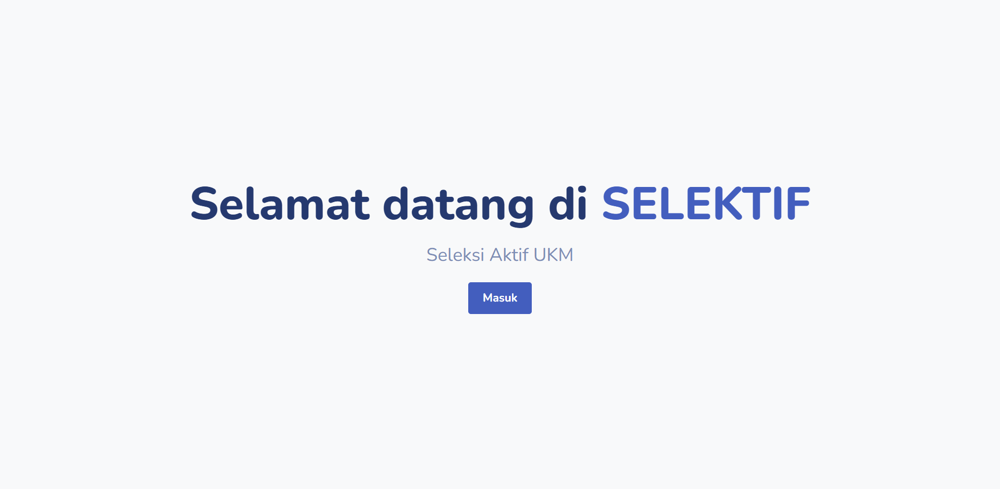
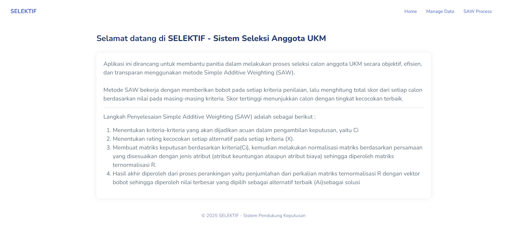
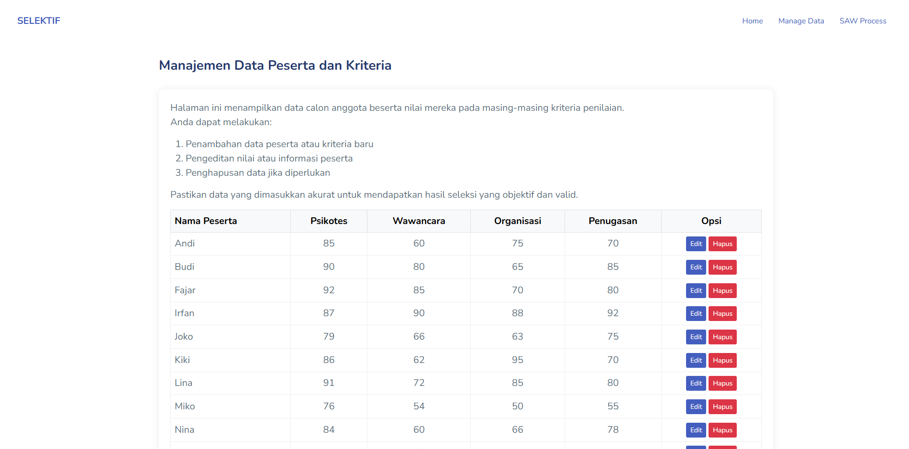
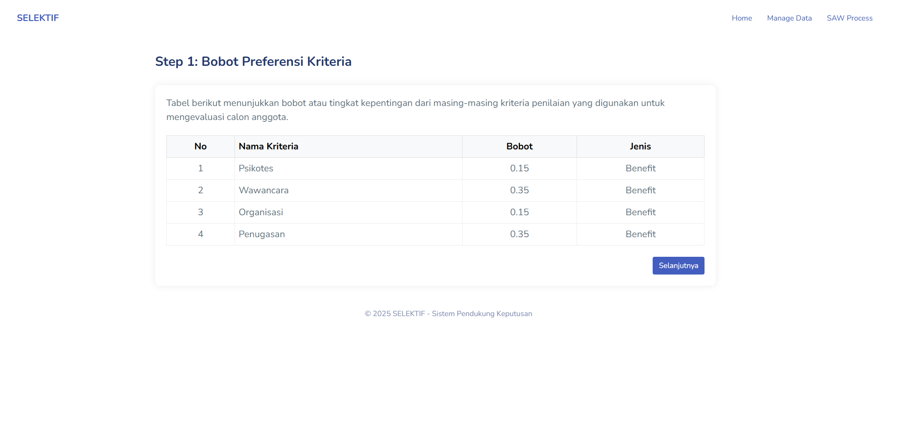
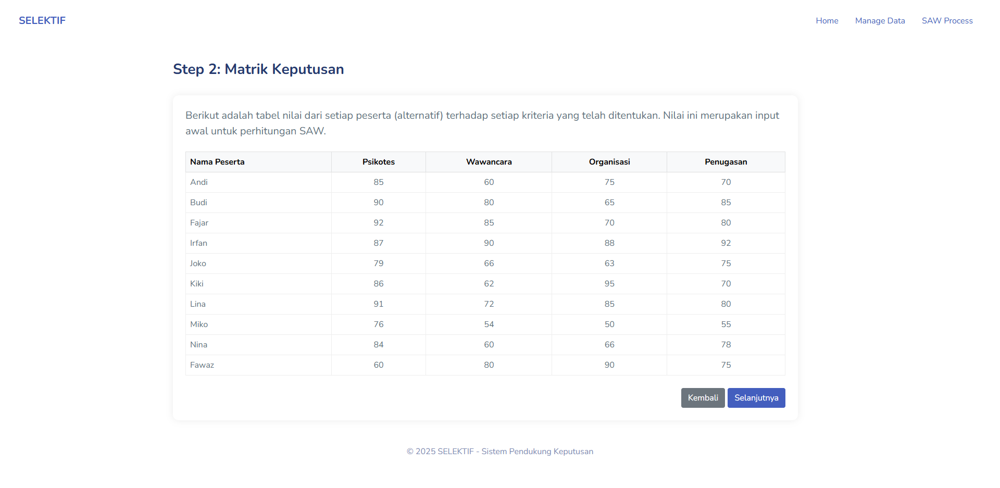
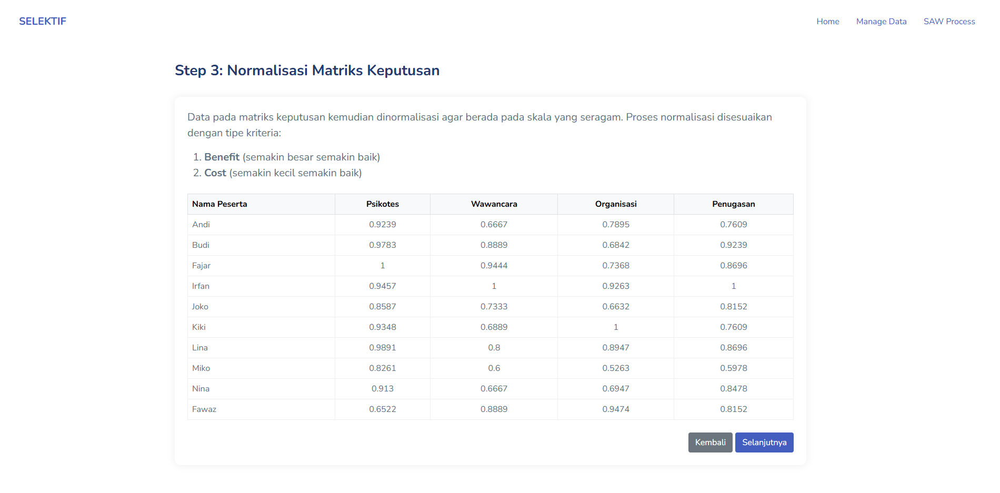
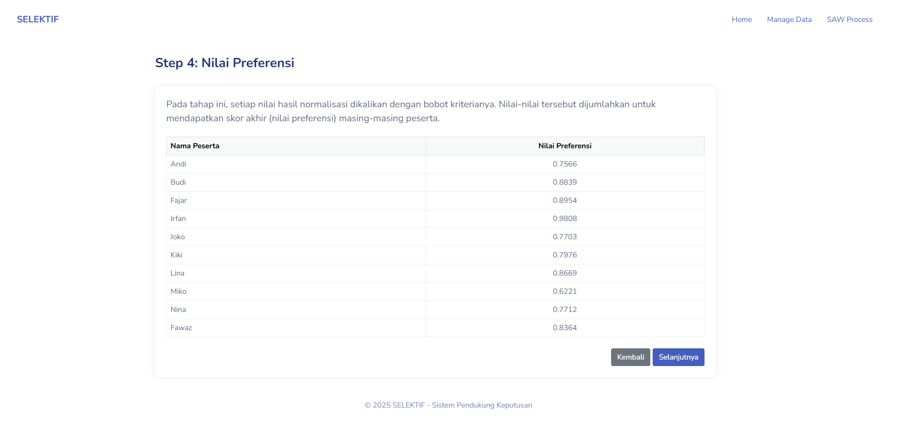
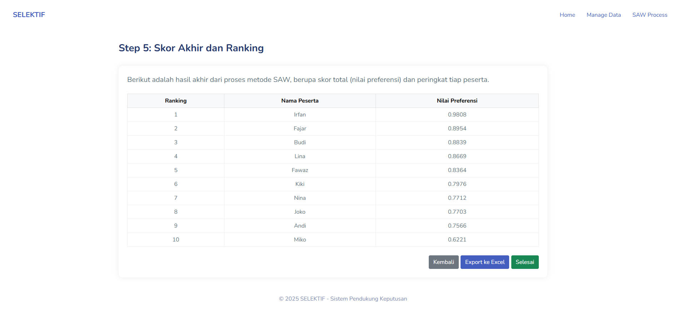

# SELEKTIF - Sistem Seleksi Anggota UKM Berbasis Web

## 📌 Deskripsi

**SELEKTIF** adalah aplikasi web untuk membantu proses seleksi calon anggota UKM secara **objektif dan efisien**. Sistem ini menggunakan metode _Simple Additive Weighting (SAW)_ sebagai dasar dalam proses pengambilan keputusan, dengan antarmuka yang ringan dan mudah digunakan.

## 🎯 Fitur Utama

- Input dan manajemen data **peserta (alternatif)**
- Input dan manajemen **kriteria beserta bobot**
- Proses perhitungan SAW:
  - Matriks keputusan
  - Normalisasi
  - Nilai preferensi
  - Skor akhir dan perankingan
- Tampilan hasil dan proses secara **bertingkat (step-by-step)**
- Responsif menggunakan **Bootstrap**

## 🛠️ Teknologi yang Digunakan

- PHP (tanpa framework)
- MySQL / MariaDB
- Bootstrap 5
- HTML5, CSS3, JavaScript

## 🗃️ Struktur Database (Tabel Utama)

- `peserta` — Menyimpan data alternatif / calon anggota
- `kriteria` — Menyimpan data kriteria dan bobot
- `nilai` — Menyimpan nilai kecocokan peserta terhadap setiap kriteria

## 📸 Tampilan Antarmuka (Screenshot)

